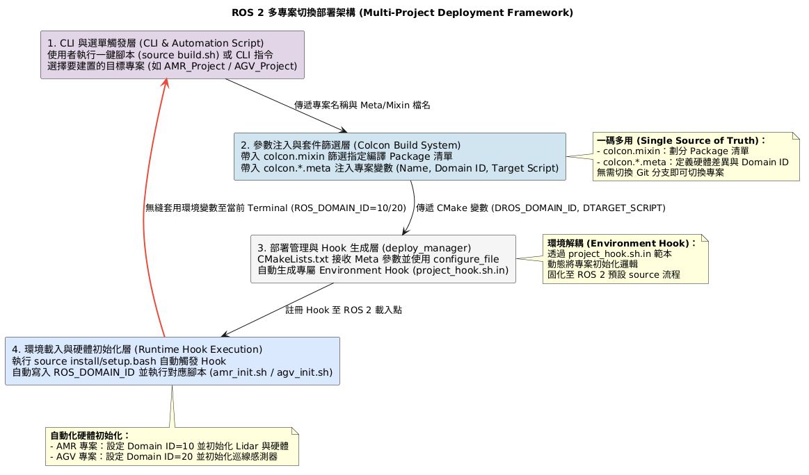
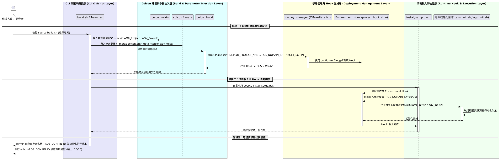

# ROS 2 多專案切換部署架構 (Multi-Project Deployment Framework)

本專案提供一套基於 `colcon.mixin` 與 `colcon.meta` 的標準化部署架構，實現**單一工作區（Workspace）切換不同車型／專案**的建置需求。


---

# 多專案切換部署


# 多專案切換部署交握圖


---

## 核心設計理念

1. **`colcon.mixin` (Packages 篩選)**：控制 CLI 命令，決定目前專案僅需編譯哪些功能套件，未選中的套件會自動忽略。
2. **`colcon.*.meta` (參數注入)**：將專案專屬變數（如 `DEPLOY_PROJECT_NAME`、`ROS_DOMAIN_ID` 與啟動腳本名稱）注入給 `deploy_manager` 套件。
3. **`deploy_manager` (環境與腳本自動化)**：透過 CMake 生成專屬 Environment Hook，當使用者執行 `source install/setup.bash` 時，自動寫入環境變數並執行對應的硬體初始化 Shell 腳本。

---

## 目錄與檔案結構

```text
ros2_ws/
├── build.sh                                # [Build entrypoint] 專案選單, Package 編譯與環境變數設定等呼叫指令腳本 
├── colcon.mixin                            # [Mixin] 定義專案對應要編譯的 Packages
├── colcon.amr.meta                         # [Meta]  AMR 專案變數 (Domain ID: 10, Script: amr_init.sh)
├── colcon.agv.meta                         # [Meta]  AGV 專案變數 (Domain ID: 20, Script: agv_init.sh)
└── src/
    └── deploy_manager/                     # 部署管理套件
        ├── CMakeLists.txt                  # 處理 Meta 參數輸入、生成 Hook 與安裝腳本
        ├── package.xml                     # 套件描述檔
        ├── env-hooks/
        │   └── project_hook.sh.in          # Environment Hook 範本檔
        └── scripts/
            ├── amr_init.sh                 # AMR 硬體與雷達初始化腳本
            └── agv_init.sh                 # AGV 巡線感測器初始化腳本
```

## colcon.mixin 內容

```text
build:
  AMR_Project:
    packages-select:
      - pkg_amr_nav
      - deploy_manager

  AGV_Project:
    packages-select:
      - pkg_agv_line
      - deploy_manager
```

## colcon.amr.meta 內容

```text
names:
  deploy_manager:
    cmake-args:
      - "-DDEPLOY_PROJECT_NAME=AMR_Project"
      - "-DROS_DOMAIN_ID=10"
      - "-DTARGET_SCRIPT=amr_init.sh"
```

## colcon.agv.meta 內容

```text
names:
  deploy_manager:
    cmake-args:
      - "-DDEPLOY_PROJECT_NAME=AGV_Project"
      - "-DROS_DOMAIN_ID=20"
      - "-DTARGET_SCRIPT=agv_init.sh"
```

## project_hook.sh.in 內容

```text
export DEPLOY_PROJECT_NAME="@DEPLOY_PROJECT_NAME@"
export ROS_DOMAIN_ID="@ROS_DOMAIN_ID@"
export TARGET_SCRIPT="@TARGET_SCRIPT@"

if [ -n "$TARGET_SCRIPT" ]; then
    _SCRIPT_PATH="$COLCON_CURRENT_PREFIX/share/deploy_manager/scripts/$TARGET_SCRIPT"
    if [ -f "$_SCRIPT_PATH" ]; then
        echo "=================================================="
        echo "[Active Project] Name           : $DEPLOY_PROJECT_NAME"
        echo "[Active Project] ROS_DOMAIN_ID  : $ROS_DOMAIN_ID"
        echo "[Active Project] Running Script : $TARGET_SCRIPT"
        bash "$_SCRIPT_PATH"
    fi
fi

```

## 檔案職責說明

| 檔案名稱 | 職責與說明 |
| :--- | :--- |
| **`colcon.mixin`** | 定義 `--mixin AMR_Project` 與 `--mixin AGV_Project`，指定要建置的 Package 清單。 |
| **`colcon.amr.meta`** | 設定 `deploy_manager` 的 CMake 參數：`-DDEPLOY_PROJECT_NAME=AMR_Project`、`-DROS_DOMAIN_ID=10`、`-DTARGET_SCRIPT=amr_init.sh`[cite: 2]。 |
| **`colcon.agv.meta`** | 設定 `deploy_manager` 的 CMake 參數：`-DDEPLOY_PROJECT_NAME=AGV_Project`、`-DROS_DOMAIN_ID=20`、`-DTARGET_SCRIPT=agv_init.sh`[cite: 1]。 |
| **`CMakeLists.txt`** | 接收 Meta 帶入的參數，使用 `configure_file` 注入 `project_hook.sh.in` 並註冊為 ROS 2 載入點[cite: 4]。 |
| **`project_hook.sh.in`** | Shell Hook 範本，當環境被 `source` 時自動設定 `ROS_DOMAIN_ID` 並執行目標腳本。 |

---

## CLI 操作指南

### 1. 切換與建置 AMR 專案 (自主移動機器人)

只會編譯 `pkg_amr_nav` 與 `deploy_manager`：

```bash
# 1. 執行建置 (指定 AMR Mixin 與 AMR Meta)
colcon build --mixin-files colcon.mixin --mixin AMR_Project --metas colcon.amr.meta --cmake-force-configure

# 2. 載入環境變數 (自動觸發 amr_init.sh)
source install/setup.bash

# 3. 驗證環境變數
echo $ROS_DOMAIN_ID
# 預期輸出: 10
```

### 2. 切換與建置 AGV 專案 (無人搬運車)

只會編譯 pkg_agv_line 與 deploy_manager：

```bash
# 1. 清理舊環境
rm -rf build/ install/ log/

# 2. 執行建置 (指定 AGV Mixin 與 AGV Meta)
colcon build --mixin-files colcon.mixin --mixin AGV_Project --metas colcon.agv.meta --cmake-force-configure

# 3. 載入環境變數 (自動觸發 agv_init.sh)
source install/setup.bash

# 4. 驗證環境變數
echo $ROS_DOMAIN_ID
# 預期輸出: 20
```
### 載入環境輸出範例

當執行 source install/setup.bash 時，Terminal 會自動印出目前專案資訊並執行對應初始化動作：

```text
==================================================
[Active Project] Name           : AMR_Project
[Active Project] ROS_DOMAIN_ID  : 10
[Active Project] Running Script : amr_init.sh
--------------------------------------------------
[SH Execution] Initializing AMR hardware & Lidar...
--------------------------------------------------
```
## 前置需求與套件安裝

在開始使用本架構之前，請確保已安裝 ROS 2 環境，並執行以下指令安裝 `colcon-mixin` 擴充套件：

```bash
# 1. 更新 apt 軟體源並安裝 colcon-mixin 套件
sudo apt-get update
sudo apt-get install -y python3-colcon-mixin

# 2. (選擇性) 初始化 colcon-mixin 預設庫
colcon mixin add default [https://raw.githubusercontent.com/colcon/colcon-mixin-repository/master/index.yaml](https://raw.githubusercontent.com/colcon/colcon-mixin-repository/master/index.yaml) 2>/dev/null || true
colcon mixin update
```

# 一鍵式自動建置與環境載入腳本 (`build.sh`)

利用純 Bash 選單（`select`）寫成的輕量化自動化腳本，無需安裝任何額外的 Python 套件（如 PyYAML），即可自動解析專案並完成建置。

透過 `source` 方式執行，能在 **建置完成後自動無縫套用 `setup.bash` 的環境變數** 至當前的 Terminal 中。

---

## 1. 使用方式

在 Terminal 執行以下指令（**必須使用 `source`**）：

```bash
source build.sh
```

# 執行效果展示

彈出互動選單：

```text
==========================================
      ROS 2 多專案自動建置部署選單        
==========================================
1) AMR_Project
2) AGV_Project
請選擇要建置的專案數字 (Ctrl+C 取消): 1
```

自動建置與載入：

輸入 1 按 Enter，腳本自動拼接並執行指令：

```bash
colcon build --mixin-files colcon.mixin --mixin AMR_Project --metas colcon.amr.meta --cmake-force-configure
```
建置成功後自動執行 source install/setup.bash，印出初始化訊息並直接在當前 Shell 寫入 ROS_DOMAIN_ID=10！

---

# CI/CD 矩陣建置與測試 (Matrix Build & Test)
利用 Git 儲存庫中的 colcon.mixin 與 colcon.*.meta，可以在 CI 流程中建立平行化的編譯與測試矩陣（Build Matrix）。

##　GitHub Actions 範例交握邏輯 (.github/workflows/ci.yml)

```yaml
name: ROS 2 Multi-Project CI

on:
  push:
    branches: [ main, develop ]
  pull_request:
    branches: [ main ]

jobs:
  build-and-test:
    runs-on: ubuntu-latest
    strategy:
      matrix:
        # 定義專案矩陣，同時測試 AMR 與 AGV
        include:
          - project: "AMR_Project"
            meta: "colcon.amr.meta"
          - project: "AGV_Project"
            meta: "colcon.agv.meta"

    steps:
      - name: Checkout Code
        uses: actions/checkout@v3

      - name: Setup ROS 2 Environment
        uses: ros-tooling/setup-ros-action@v0.7
        with:
          required-ros-distributions: jazzy

      - name: Install colcon-mixin
        run: |
          sudo apt-get update
          sudo apt-get install -y python3-colcon-mixin

      # 1. 矩陣式編譯：精準帶入對應專案的 Mixin 與 Meta
      - name: Colcon Build
        run: |
          colcon build \
            --mixin-files colcon.mixin \
            --mixin ${{ matrix.project }} \
            --metas ${{ matrix.meta }} \
            --cmake-force-configure

      # 2. 自動化測試：只測試該專案包含的 Packages
      - name: Colcon Test
        run: |
          colcon test \
            --mixin-files colcon.mixin \
            --mixin ${{ matrix.project }}

      - name: Test Results Summary
        run: colcon test-result --all
```
---

# 多機型 Docker Image 自動化打包 (Docker Multi-Target)
---
架構中的 colcon.*.meta 能直接傳入 Dockerfile 的 BUILD_ARG，讓您用同一份 Dockerfile 打出不同車型專屬的部署 Image。


Dockerfile 範例 (Dockerfile)

```Dockerfile
FROM ros:jazzy-ros-base

ARG PROJECT_NAME=AMR_Project
ARG META_FILE=colcon.amr.meta

WORKDIR /workspace
COPY . /workspace/src/app

# 安裝相依套件與編譯
RUN apt-get update && apt-get install -y python3-colcon-mixin && \
    cd /workspace/src/app && \
    colcon build \
      --mixin-files colcon.mixin \
      --mixin ${PROJECT_NAME} \
      --metas ${META_FILE} \
      --cmake-force-configure

# 自動將 source install/setup.bash 寫入 entrypoint
ENTRYPOINT ["/bin/bash", "-c", "source /workspace/src/app/install/setup.bash && \"$@\"", "--"]
CMD ["bash"]
```

---

CI 中呼叫 Docker Build

```bash
# 建置 AMR 專用映像檔
docker build \
  --build-arg PROJECT_NAME=AMR_Project \
  --build-arg META_FILE=colcon.amr.meta \
  -t my-registry/amr-fleet:v1.0 .

# 建置 AGV 專用映像檔
docker build \
  --build-arg PROJECT_NAME=AGV_Project \
  --build-arg META_FILE=colcon.agv.meta \
  -t my-registry/agv-fleet:v1.0 .
```

---

發行 Debian 獨立安裝包 (.deb)

若要在實體機器人（如 NVIDIA Jetson 或工業電腦）上進行無原始碼部署，可搭配 bloom 或 cpack 將建置產物打包成 Debian 套件。

1. 變數固化：在 CI Pipeline 帶入 --metas colcon.amr.meta 編譯後，deploy_manager 生成的 project_hook.sh 會被直接打包進 .deb 的 /opt/ros/jazzy/share/deploy_manager/environment/ 目錄中。

2. 現場部署：現場工程師在車載電腦執行 sudo dpkg -i ros-jazzy-deploy-manager_0.0.1_arm64.deb 後，只要 source /opt/ros/jazzy/setup.bash，終端機就會自動觸發 amr_init.sh 並將 ROS_DOMAIN_ID 設定為 10。

---

## 專案層級的優勢

1. 「一碼多用（Single Source of Truth）」架構
在早期的機器人開發中，很多團隊會因為 AMR 和 AGV 硬體不同，直接在 Git 拉出 branch-amr 和 branch-agv 兩條分支，或者維護兩份 Workspace。這種做法到了後期維護會演变成災難（例如修補一個導航 Bug 要複製貼上到 5 個分支）。

業界現行做法：主幹開發（Trunk-based development）。原始碼完全統一，硬體差異、功能模組與環境變數全靠 Build System（Colcon/CMake）的 Meta/Mixin 檔與外掛參數去定義。這也是為什麼這套架構能直接接入 Docker 與 CI/CD 矩陣編譯。

2. 環境解耦與自動化 Setup Hook
機器人在現場（Field Deployment）最常遇到的低級錯誤就是「ROS_DOMAIN_ID 設錯導致通訊串流亂掉」或「硬體驅動沒載入」。

業界現行做法：將環境初始化封裝進 Deploy Package（如您的 deploy_manager），透過 ament 的 environment_hooks 機制固化到 install/setup.bash。現場操作人員或系統開機服務（systemd）只需執行單一 source 指令，底層參數與腳本便自動生效，降成本且極度防呆。

3. CI/CD 與容器化部署（DevOps for Robotics）
現代 AMR 廠商在工廠部署時，幾乎不再直接在車載電腦（如 NVIDIA Jetson 或工業電腦）上手動編譯原始碼，而是採用 Docker 容器 或 Debian 系統包（.deb） 部署。

業界現行做法：正如前面展示的 CI/CD 流程，利用相同的代碼庫，在 GitHub Actions 或 Jenkins 帶入不同的 .meta 配置，幾分鐘內就能自動 build 出 AMR-v1.0.deb 或 AGV-v1.0.deb 產物，並推送到車載裝置進行 OTA 更新。